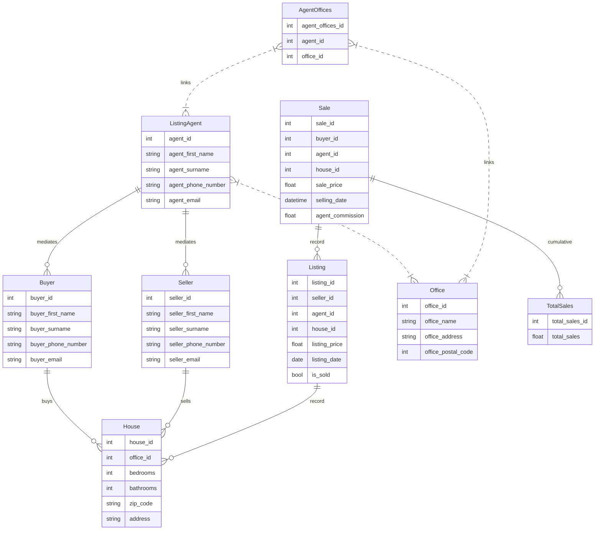

## Introduction
An implementation of a head office database application for a franchise real estate company.

#### Hypothetical story
The database system is for a large franchised company called Real Ventures which has over 20 offices each in different states inside the United States. Since each state has its own laws, an office can only sell a house in its own state but a real estate agent can be associated with multiple offices and be in charge of multiple listings.

If a house is marked as sold, a commission price to the agent is automatically calculated and recorded on the database.

| Sale price                | Commission    |
|---------------------------|---------------|
| < $100,000                | 10%           |
| $100,000 - $200,000       | 7.5%          |
| $200,000 - $500,000       | 6%            |
| $500,000 - $1,000,000     | 5%            |
| > $1,000,000              | 4%            |

Possible filters can be added to retrieve information that is relevant for the head office to analyze e.g.
- Top 5 offices with the most sales for that month.
- Top 5 estate agents who have sold the most.
- The commission that each estate agent must receive.
    - The average number of days that the house was on the market.
- The average selling price for all houses sold in a month.

These filters can be accessed by runnning:
```
python3 scripts/query_data.py
```

### Tables
```
House
    - house_id (PK)
    - bedrooms
    - bathrooms
    - address
    - zip_code
    - office_id

Buyer
    - buyer_id (PK)
    - buyer_first_name
    - buyer_surname
    - buyer_phone_number
    - buyer_email

Seller
    - seller_id (PK)
    - seller_first_name
    - seller_surname
    - seller_phone_number
    - seller_email

Agent
    - agent_id (PK)
    - agent_first_name
    - agent_surname
    - agent_phone_number
    - agent_email

Office
    - office_id (PK)
    - office_name
    - office_address
    - office_postal_code

AgentOffices
    - agent_offices_id (PK)
    - agent_id (FK)
    - office_id (FK)

Listing
    - listing_id (PK)
    - seller_id (FK)
    - agent_id (FK)
    - house_id (FK)
    - listing_price
    - listing_date
    - is_sold

Sale
    - sale_id (PK)
    - buyer_id (FK)
    - agent_id (FK)
    - house_id (FK)
    - sale_price
    - selling_date
    - agent_commission

TotalSales
    - total_sales_id (PK)
    - total_sales

```

#### To view this install the Markdown Preview Mermaid Support Extension on VSCode


### Solution Description
The components of the problem are broken down to seven tables i.e. `House`, `Buyer`, `Seller`, `Agent`, `Office`, `AgentOffices`, `Listing`, `Sale` and `TotalSales`. 

**Relationship 1**: A house and a buyer/seller has a one-to-many relationship i.e. a house only has one buyer and seller (different from people who bid during the listing) but a buyer and seller can have multiple houses.
**Relationship 2**: Multiple offices can have multiple agents i.e. an agent can be associated with multiple offices and an office can have multiple agents. To represent this, a composite table `AgentOffices` is used to hold the many-to-many relationship by storing the foreign keys between them.
**Relationship 3**: A sale should be associated by one buyer, seller, agent and house. Once a house is sold, it's house ID should not occur again in the `Listing` table (unique).
**Relationship 4:** A house is connected to a branch through a many-to-one relationship whereby multiple houses in the same location are managed by one branch.
**Relationship 5:** A house has a single listing and sale i.e. a one-to-one relationship whereby each house has a unique listing and a unique sale.

### The Application
### Setting up and Running the Application
```bash
python3.6 -m venv venv
venv\Scripts\activate.bat
pip3 install -r requirements.txt

# generate synthetic data and record them to the database [runs the functions inside create.py which inserts synthetic data into the database]
python3 main.py
```

#### Insert/Display transaction data
```
python3 scripts/insert_data.py
```

#### Query the solutions to the problem set and display the data
```
python3 scripts/query_data.py
```

### Tests
To run the tests, execute the following command in your terminal.
```
python3 tests/tests.py
```