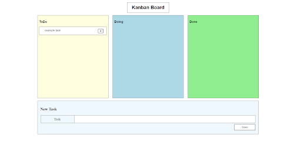

## A Brief Description of my Kanban board implementation
The Kanban board is split into three categories named tasktype which are todo, doing and done. A task can be created to the `todo` section by filling in the input form below. Once added, the tasks can be moved to different categories with persistence. The task can also be deleted from the database by pressing the X button at the right side of the task.



### Creation of tasks
To create new tasks, a `POST` request is sent from the input via a form after the `Save` button is clicked. The `/update_form` endpoint is hit with a `POST` body in the form {"task-name": "add-groceries"} which represents the `Add groceries` task. The text in the body is saved to the database via session.commit() function whereby a new variable `taskrep` is created to represent the task name.

### Movement of tasks
To move tasks from one category to another, a draggable event is created which listens for the mouse drag and drop functionality. Once a task is dropped into its respective category, a `GET` request in the form /move_task/<taskrep>/<tasktype> is sent where the taskrep is the representation of the task name and tasktype is the category to modify it in. The new modification is saved into the database making the task persistent in its category even after refreshing.

### Deletion of tasks
To delete tasks, a `POST` request is sent in the form {"delete-task": "add-groceries"} which represents the Add groceries task. The function then relates the add-groceries attribute in the `taskrep` column of the database and deletes the respective field.

#### Running the app
To run the app, run the following command on the main directory of the project:
```bash
conda create --name kanban python=3.6
pip install -r requirements.txt
python app.py
```

#### Running the tests
To run the tests, run the following command on the main directory of the project:
```bash
python tests/tests.py
```

